# Documentation on NSM-Infrastructure

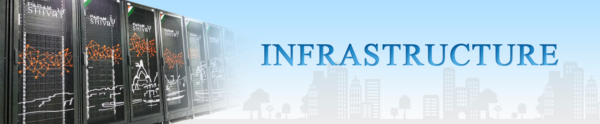
## About NSM Infrastructure: 
The National Supercomputing Mission aims at achieving the goals of attaining self-reliance in supercomputing, building the culture of using supercomputing for carrying out R&D and problem-solving in various domains of scientific and technological endeavours, and designing solutions for various societal applications, and positioning the supercomputing ecosystem in the country at a globally competitive level.

The mission envisions the creation of a national infrastructure of supercomputing systems and facilities of various sizes and scales, distributed across the country and seamlessly integrated through the National Knowledge Network.

The systems and facilities created as part of the infrastructure under this mission are divided into three phases of the National Supercomputing Mission: Phase I, Phase II, and Phase III
## NSM Systems: 

<!-- First row  -->

    

        <a href="https://nsmindia.in/node/155">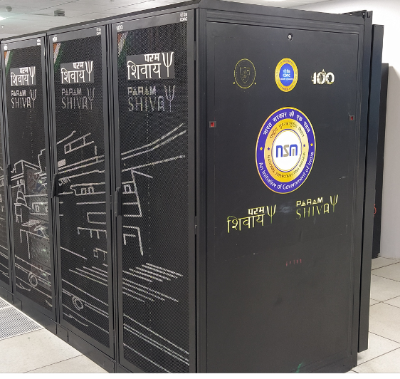
        
PARAM Shivay, IIT (BHU)
</a>
    

    

        <a href="https://nsmindia.in/node/156">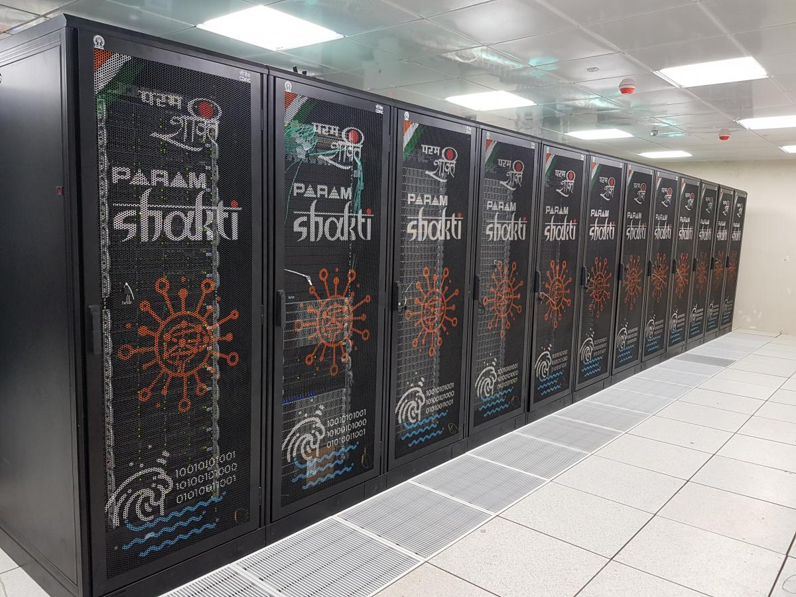
        
PARAM Shakti, IIT (Kharagpur)
</a>
    

    

        <a href="https://nsmindia.in/node/157">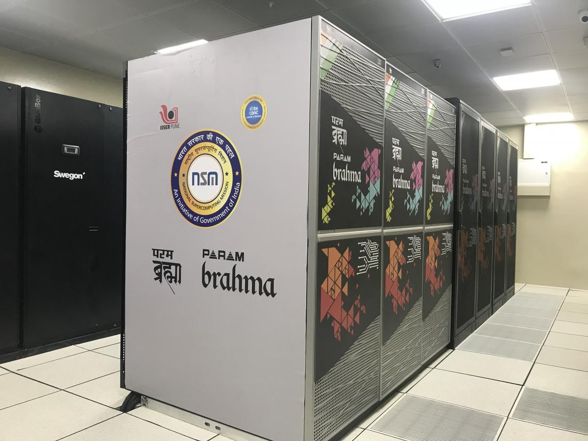
        
PARAM Brahma, IISER (Pune)
</a>
    

    

        <a href="https://nsmindia.in/node/158">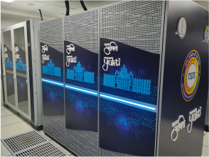
        
PARAM Yukti, JNCASR (Bangalore)
</a>
    

    

        <a href="https://nsmindia.in/node/165">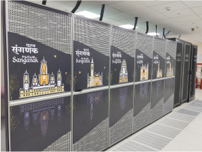
        
PARAM Sanganak, IIT (Kanpur)
</a>
    

<!-- Second Row -->

    

        <a href="https://nsmindia.in/node/185">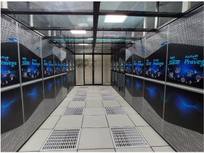
        
PARAM Pravega, IISc (Bangalore) 
</a>
    

    

        <a href="https://nsmindia.in/node/183">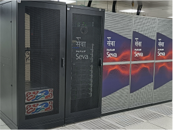
        
PARAM Seva, IIT (Hyderabad)
</a>
    

    

        <a href="https://nsmindia.in/node/184">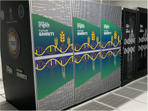
        
PARAM Smriti, NABI (Mohali)
</a>
    

    

        <a href="https://nsmindia.in/node/181">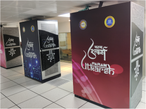
        
PARAM  Utkarsh, C-DAC (Bangalore)
</a>
    

        

        <a href="https://nsmindia.in/node/182">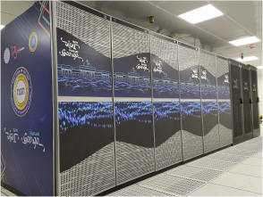
        
PARAM  Ganga, IIT (Roorkee)
</a>
    

<!-- Third Row -->

    

        <a href="https://nsmindia.in/node/201">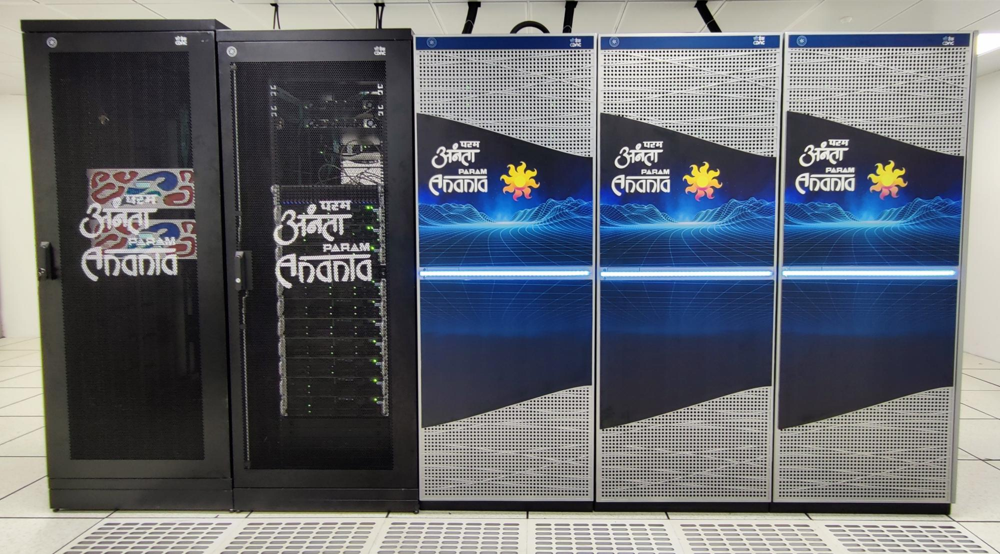
        
PARAM Ananta, IIT (Gandhinagar)
</a>
    

    

        <a href="https://nsmindia.in/node/202">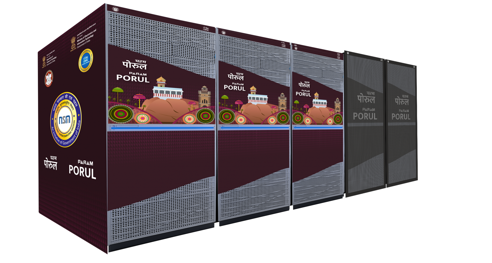
        
PARAM Porul, NIT (Trichy)
</a>
    

    

        <a href="https://nsmindia.in/node/203">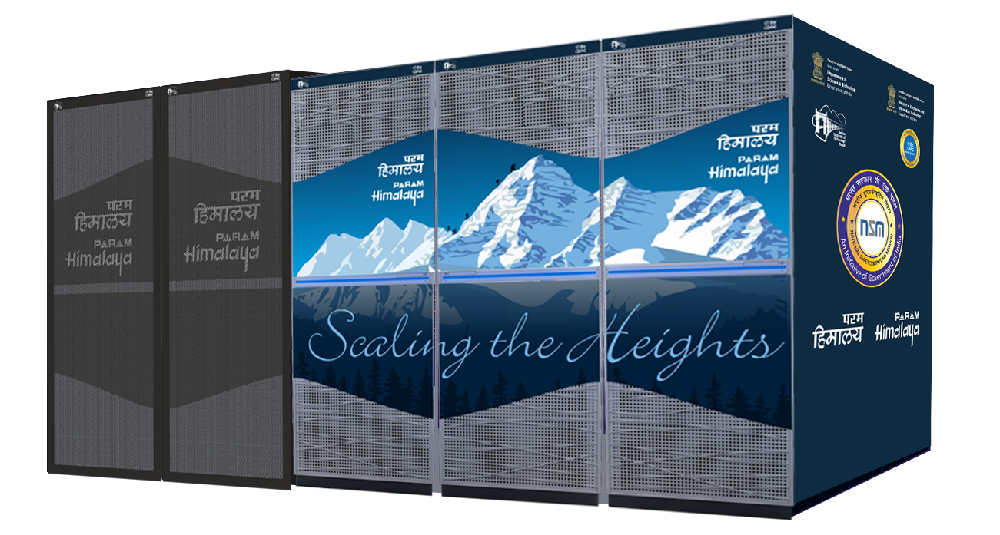
        
PARAM Himalaya, IIT (Mandi)
</a>
    

    

        <a href="https://nsmindia.in/node/204">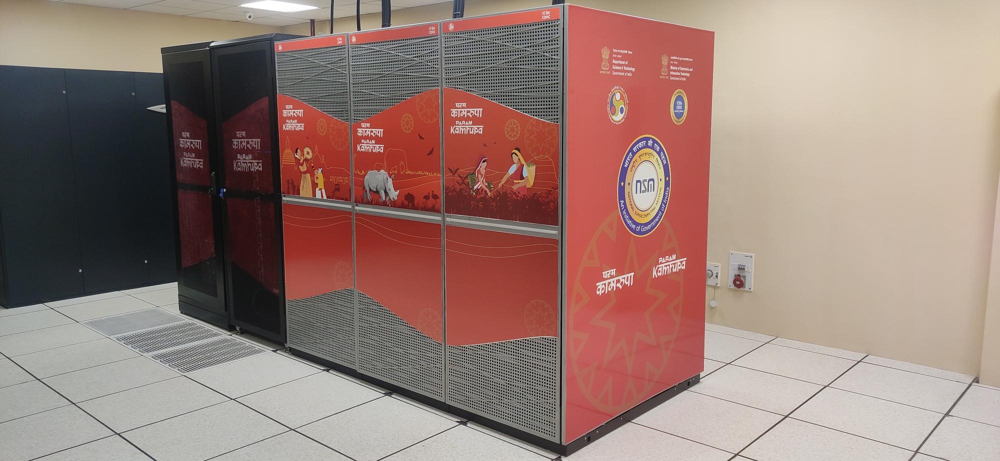
        
PARAM  Kamrupa, IIT (Guwahati)
</a>
    

        

        <a href="https://nsmindia.in/node/218">
        
PARAM  Siddhi-AI, C-DAC (Pune)
</a>
    

<!-- Fourth Row -->

    

        <a href="https://nsmindia.in/node/240">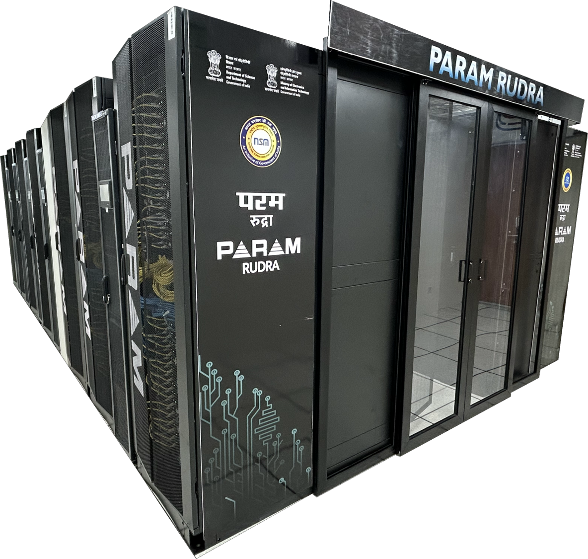
        
PARAM Rudra, IUAC (Delhi)
</a>
    

    

        <a href="https://nsmindia.in/node/241">
        
PARAM Rudra, SN Bose (Kolkata)
</a>
    

    

        <a href="https://nsmindia.in/node/242">
        
PARAM Rudra, GMRT (Narayangaon)
</a>
    

## Upcoming NSM Systems: 

<table>
  <tr>
    <th>Theoretical Performance</th>
    <th>Location</th>
  </tr>
  <td>
  20 PF
  </td>
  <td>
  C-DAC, Bangalore
  </td>

</table>

## Accessing NSM Systems: 

**User Creation Portal:** 
  The User Creation portal is designed to streamline the user registration and account creation process. Here's how it works:

1. **User Registration:**
   Users register by providing their official / institutional email address, city, and institute name. A verification email is sent to confirm the provided email.

2. **Account Setup:** 
   After email verification, users receive a link to complete their registration through a detailed form. Users have the ability to preview and edit the form before submitting it.

3. **Document Upload:** 
   Once the registration form is submitted, a link is provided for uploading required documents, such as ID proof, the User Creation Form, and other relevant documents. Please note, after document submission, no further edits can be made, as the documents enters into a verification process.

4. **Verification & Approval:**
   The submitted user details and documents are verified by the user’s Institute Head of Department (HOD) or Principal Investigator (PI) and Facility/Host Institute. Upon successful verification, the user receives their HPC System credentials.

For accessing the NSM hpc system kindly register on <a href="https://services.nsmindia.in/userportal/account">User creation Portal</a> with institutional Email ID 

 

<!-- **`Disclaimer: Allocation will be decided by C-DAC and Host Institute as per Policies`** -->
<strong>Disclaimer:</strong> Allocation will be decided by C-DAC and Host Institute as per their policies.

- For further information of User creation Portal, Kindly refer <a href="https://nsmindia.in/sites/default/files/User Creation Manual-User_ver_2.0.pdf">User Creation Guide</a>

- kindly contact <a href="mailto:nsmsupport@cdac.in">nsmsupport@cdac.in</a> for any queries.
 
 

<!-- 
For further information kindly go through the <a href="https://nsmindia.in/sites/default/files/User Creation Manual-User_ver_2.0.pdf">User Manual</a>

kindly contact <a href="mailto:nsmsupport@cdac.in">nsmsupport@cdac.in</a> for any queries.
 -->
 

<!-- 
4. External users can approach C-DAC through <a href="mailto:nsmsupport@cdac.in">nsmsupport@cdac.in</a> for resource access.

<!-- 
For Further information kindly visit <a href="https://nsmindia.in/sites/default/files/NSM-SoP-AllocationAndAccount_latest_edited.pdf">NSM resource allocation process<a>

For Infrastructure related information kindly visit <a href="https://nsmindia.in/infra">NSM Infrastructure<a>
 --> 

 

## HPC Usage Charging Policy:

<table>
  <tr>
    <th>User Category</th>
    <th>Academic and R&D Institutions</th>
    <th>MSME</th>
    <th>Commercial Users</th>
  </tr>
  <tr>
    <td>Priority</td>
    <td>Normal</td>
    <td>High</td>
    <td>High</td>
  </tr>
  <tr>
    <td>CPUcore/hr</td>
    <td>Rs. 0.96</td>
    <td>Rs. 0.96</td>
    <td>Rs. 1.50</td>
  </tr>
  <tr>
    <td>GPUcard/hr</td>
    <td>Rs. 42</td>
    <td>Rs. 42</td>
    <td>Rs. 100</td>
  </tr>
  <tr>
    <td>Storage/month</td>
    <td>100GB free/account  
    Rs. 1/GB thereafter</td>
    <td>100GB free/account  
    Rs. 1/GB thereafter</td>
    <td>100GB free/account  
    Rs. 1.50/GB thereafter</td>
  </tr>
  <tr>
    <td>Billing Period</td>
    <td>Monthly/Quarterly/Annually</td>
    <td>Monthly/Quarterly/Annually</td>
    <td>Monthly/Quarterly/Annually</td>
  </tr>
</table>

 

<!-- 
# Param Pravega Details:
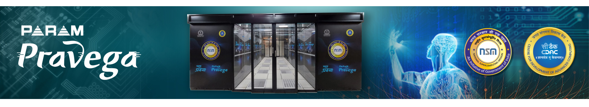
PARAM Pravega, a cutting-edge supercomputing facility, was established under Phase-2 of the National Supercomputing Mission's build approach. It boasts a peak computing power of 3.3 PFLOPS and was designed and commissioned by C-DAC to meet the computational needs of IISc, Bangalore, and various research and engineering institutes in the region. The system is valuable for research in various scientific domains, including Weather & Climate, Oil & Gas, Seismic, Life, Material sciences, and more.

## System Configuration: 
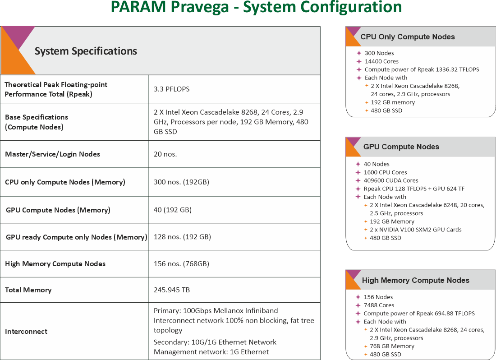

## Architecture Diagram: 
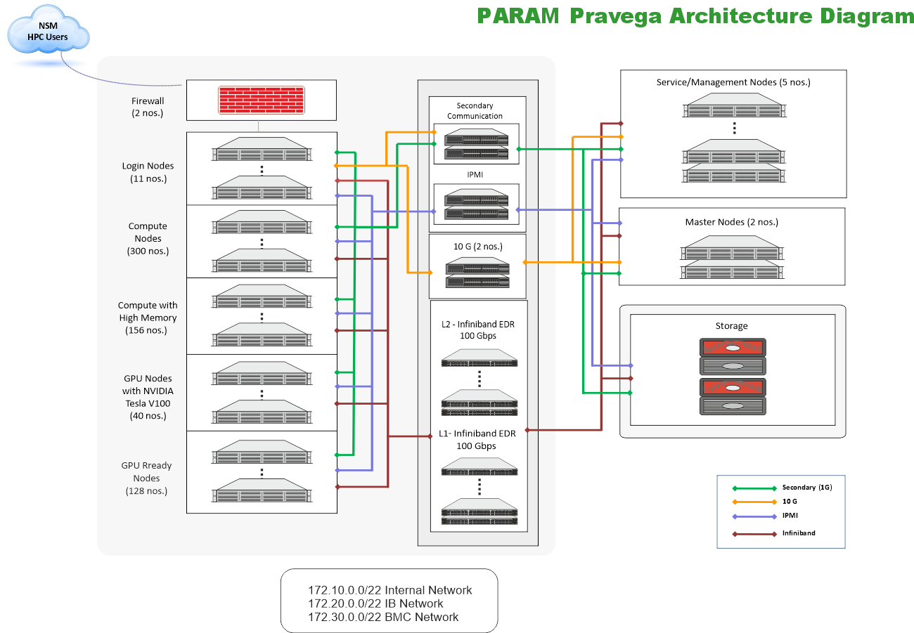

## Software Stack: 
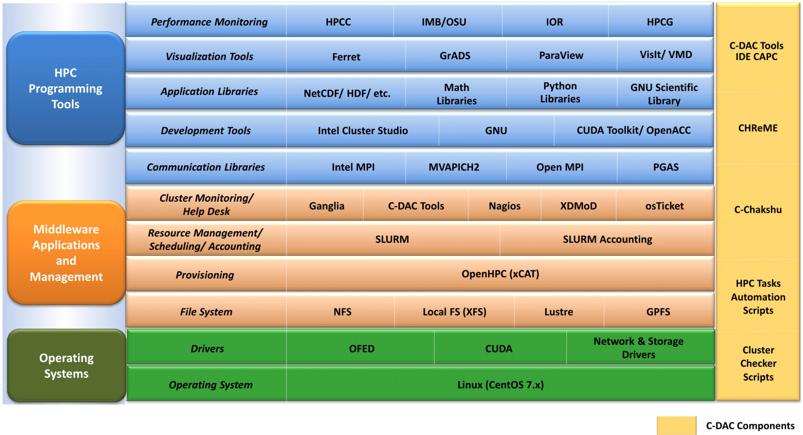

## Installed Applications/Libraries:

<table>
    <tr>
        <td rowspan="5"><strong>HPC Applications</strong></td>
        <td>Bio-informatics</td>
        <td>MUMmer, HMMER, MEME, PHYLIP, mpiBLAST, ClustalW</td>
    </tr>
    <tr>
        <td>Molecular Dynamics</td>
        <td>NAMD (for CPU and GPU), LAMMPS, GROMACS</td>
    </tr>
    <tr>
        <td>CFD</td>
        <td>OpenFOAM, SU2</td>
    </tr>
    <tr>
        <td>Material Modeling, Quantum Chemistry</td>
        <td>Quantum-Espresso, Abinit, CP2K, NWChem</td>
    </tr>
    <tr>
        <td>Weather, Ocean, Climate</td>
        <td>WRF-ARW, WPS (WRF), ARWPost (WRF), RegCM, MOM, ROMS</td>
    </tr>
    <tr>
        <td><strong>Deep Learning Libraries</strong></td>
        <td colspan="2">cuDNN, TensorFlow, Theano</td>
    </tr>
    <tr>
        <td><strong>Dependency Libraries</strong></td>
        <td colspan="2">NetCDF, PNETCDF, Jasper, HDF5, Tcl, Boost, FFTW</td>
    </tr>
</table>
 

***Note: The same details apply to all clusters.*** -->

